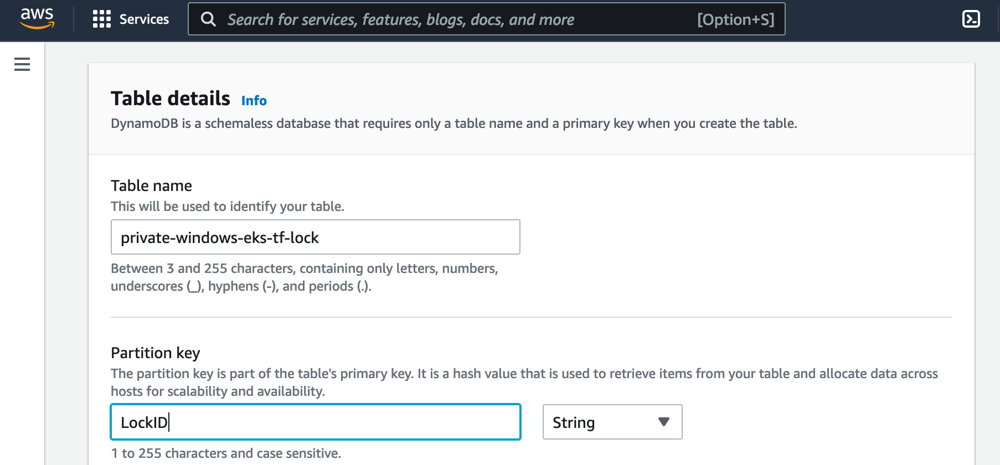
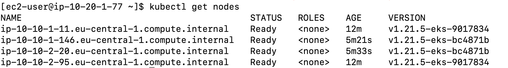

# private-eks-for-windows-workloads-with-terraform
<!---
This is a sample repository for the accompanying AWS Container Blog Post *Running Windows workloads on a private EKS cluster*.  
-->

This repository provides a Terraform implementation that deploys an Amazon EKS cluster in a private VPC and deploys Windows and Linux worker nodes into the cluster. The private VPC and EKS cluster are deployed via a bastion host in a public VPC that can access the private VPC via VPC peering. The public VPC and bastion host setup is part of this repository as well.

Solution Architecture:


### Prerequisites

- AWS Account with command line access, https://docs.aws.amazon.com/cli/latest/userguide/cli-configure-files.html.
- Set up Terraform. For steps, see Terraform downloads (https://www.terraform.io/downloads.html).
- S3 bucket to save the state.
- DynamoDB table for the statelock with partition key "LockID" of type String.

### How to use

#### VPC and bastion host setup

This performs the deployment of the VPC including the setup of the bastion host in a separate VPC. 

1. Clone this repository 

2. Create an EC2 SSH key in your AWS account if there is none existing by following this documentation: [Create a key pair using Amazon EC2](https://docs.aws.amazon.com/AWSEC2/latest/UserGuide/ec2-key-pairs.html#having-ec2-create-your-key-pair)

3. Replace the backed configuration in the [network/main.tf](./network/main.tf) with an S3 bucket and Amazon DynamoDB table with partition key *LockID* of type String in your AWS account. Refer to [S3 Backend](https://www.terraform.io/language/settings/backends/s3) for details.

   1. Follow the [Userguide](https://docs.aws.amazon.com/AmazonS3/latest/userguide/create-bucket-overview.html) to create a S3 bucket.
   2. Follow the [Developerguide](https://docs.aws.amazon.com/amazondynamodb/latest/developerguide/getting-started-step-1.html) to create a DynamoDB table with the correct Partition key:

   

   3. Insert correct values in [network/main.tf](./network/main.tf) :

      ````
      //Modify the bucket and dynamoDB table that are used by Terraform
      terraform {
        backend "s3" {
          bucket         = "DOC-EXAMPLE-BUCKET"
          key            = "network.tfstate"
          region         = "eu-central-1"
          dynamodb_table = "private-windows-eks-tf-lock"
        }
      }
      ````

4. Make sure that you are logged into your AWS account using the AWS CLI. Refer to [CLI Quickstart](https://docs.aws.amazon.com/cli/latest/userguide/cli-configure-quickstart.html) for details.

5. Open a command line and move into the folder *network* and execute the deployement with Terraform:

   ````bash
   |-- private-eks-for-windows-workloads-with-terraform 
   |   |-- network
   |   |   |-- main.tf
   |   |   |-- main-input.tfvars
   ````

   ```
   $ cd network
   $ terraform init
   $ terraform apply -var-file main-input.tfvars
   ```

6. Note down the output of *out_bastion_public_ip*. 

#### EKS Cluster setup

This performs the deployment of the EKS cluster and the nodegroups for Windows and Linux.

Make sure to execute the Terraform script from inside the bastion host as otherwise Terraform will not be able to connect to the EKS cluster as the private endpoint will only be accessible from within the private VPC itself or a peered VPC. 

1. SSH into the Linux node. 

```
$ ssh ec2-user@<out_bastion_public_ip> -i <location_of_private_key>
```

2. Clone the git repo to the bastion host.

3. Replace the backed configuration in the [main.tf](./main.tf) with the same S3 bucket used for the network setup and DynamoDB table in your AWS account. 
   Add the correct backend configuration for *terraform_remote_state.network* as well.

   ````
   //Modify the bucket and dynamoDB table that are used by Terraform
   terraform {
     backend "s3" {
       bucket         = "DOC-EXAMPLE-BUCKET"
       key            = "private-windows-eks.tfstate"
       region         = "eu-central-1"
       dynamodb_table = "private-windows-eks-tf-lock"
     }
   }
   
   data terraform_remote_state "network" {
       backend = "s3"
       config = {
           bucket = "DOC-EXAMPLE-BUCKET"
           key = "network.tfstate"
           region = "eu-central-1"
        }
   }
   ````

4. If you are using a federated role to access the AWS console, then replace the role ARN in [additional_roles_aws_auth.yaml](./yaml-templates/additional_roles_aws_auth.yaml) with the role that gets federated to allow access to the EKS cluster from the AWS console for you.

5. Deploy the EKS cluster with the following commands from the root folder of the solution:

   ````bash
   |-- private-eks-for-windows-workloads-with-terraform 
   |   |-- main.tf
   |   |-- main-input.tfvars
   ````

```bash
$ terraform init
$ terraform apply -var-file main-input.tfvars
```

5. The Windows nodes can take a few minutes until they are successfully bootstrapped and connected to the cluster.

#### Validate deployment

1. After the deployment is done, you can configure the local kubectl on the bastion host to connect to the EKS cluster.

```bash
$ aws eks update-kubeconfig --name sample-cluster-01 --region eu-central-1
$ kubectl get nodes
```



## Cleanup

### EKS Cluster

Execute the following inside of the root path of the repository inside the bastion host to clean-up the EKS cluster as well as the worker nodes:

````bash
|-- private-eks-for-windows-workloads-with-terraform 
|   |-- main.tf
|   |-- main-input.tfvars
````

```bash
$ terraform destroy -var-file main-input.tfvars
```

### Bastion Host & VPCs

Execute the same Terraform command again from your local workstation inside the network directory to clean-up the bastion host and both VPCs:

````bash
|-- private-eks-for-windows-workloads-with-terraform 
|   |-- network
|   |   |-- main.tf
|   |   |-- main-input.tfvars
````

```bash
$ terraform destroy -var-file main-input.tfvars
```


## Parameters in main-input.tfvars

The repository provides the following defaults for the setup:

- region = "eu-central-1"
- VPC
  - azs_private = ["eu-central-1a", "eu-central-1b", "eu-central-1c"]
  - private_subnets = ["10.10.1.0/24", "10.10.2.0/24", "10.10.3.0/24"]
  - vpc_private_cidr = "10.10.0.0/16"
  - vpc_public_cidr = "10.20.0.0/16"
  - azs_public = ["eu-central-1a"]
  - public_subnets = ["10.20.1.0/24"]

- EKS cluster
  - eks_cluster_name = "sample-cluster-01"
  - eks_cluster_version = "1.21"
- Linux nodegroup
  - lin_desired_size = "2"
  - lin_max_size = "2"
  - lin_min_size = "2"
  - lin_instance_type = "t3.medium"

- Windows nodegroup
  - win_desired_size = "2"
  - win_max_size = "2"
  - win_min_size = "2"
  - win_instance_type = "t3.xlarge"

## Security

See [CONTRIBUTING](CONTRIBUTING.md#security-issue-notifications) for more information.

## License

This library is licensed under the MIT-0 License. See the LICENSE file.

